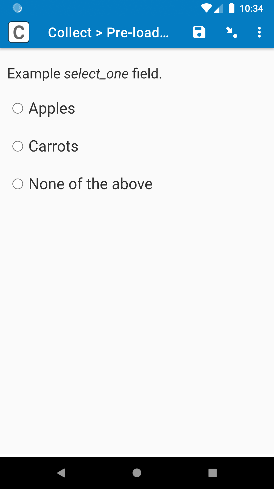
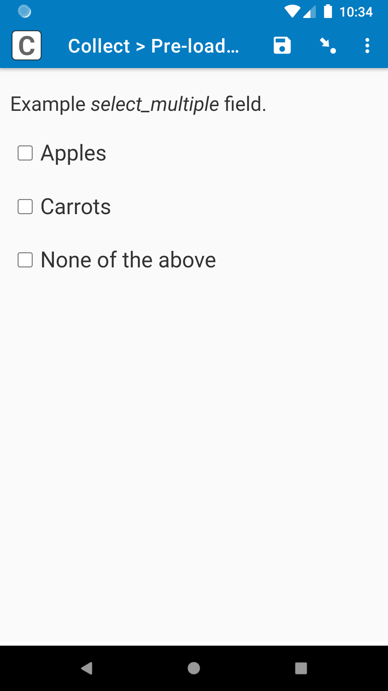
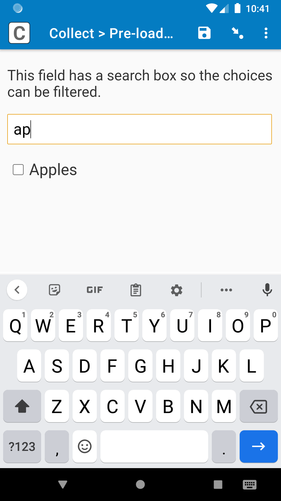

# Pre-load filter

|  |  |
|:---:|:---:|
| *select_multiple* | Using search box |

## Description

This field plug-in allows you to dynamically filter a pre-loaded choice list, much like using the [selected() function](https://docs.surveycto.com/02-designing-forms/01-core-concepts/09.expressions.html#Help_Forms_selected) in a [choice filter](https://support.surveycto.com/hc/en-us/articles/360033126194).

This field plug-in is built on the [select_one-select_multiple](https://github.com/surveycto/select_one-select_multiple) field plug-in, so it has all of the capabilities of that field plug-in. It also has the capabilities of the [search-select-one](https://github.com/surveycto/search-select-one) and [search-select-multiple](https://github.com/surveycto/search-select-multiple) field plug-in, so you can enumerators can also use a search box to find the choices they need.

If you have never pre-loaded choices before, check out our documentation on [loading multiple-choice options from pre-loaded data](https://docs.surveycto.com/02-designing-forms/03-advanced-topics/04.search-and-select.html), as well as [this webinar](https://www.surveycto.com/videos/preloading-multiple-choices-webinar/).

### Features

* Exclude specified choices with exceptions.
* Only include specified choices, while excluding all others.
* Optional search box to allow enumerators to find choices more easily.
* All of the capabilities of the [select_one-select_multiple](https://github.com/surveycto/select_one-select_multiple) field plug-in.

To learn how to customize the field plug-in, check out the [parameters](#parameters) below,.

### Data format

Data will be stored in the same format as the original field type. For a *[select_one](https://docs.surveycto.com/02-designing-forms/01-core-concepts/03h.field-types-select-one.html)* field, it will store the value of the selected choice. For a *[select_multiple](https://docs.surveycto.com/02-designing-forms/01-core-concepts/03i.field-types-select-multiple.html)* field, it will store the values of the selected choices in a space-separated list.

## How to use

### Getting started

**To use this field plug-in as-is**, just download the [preload-filter.fieldplugin.zip](https://github.com/surveycto/preload-filter/raw/main/preload-filter.fieldplugin.zip) file from this repo, and attach it to your form.

**To use with the sample form:**

1. Download the [sample form](https://github.com/surveycto/preload-filter/raw/main/extras/sample-form/Pre-load%20filter%20sample%20form.xlsx) and [media files](https://github.com/surveycto/preload-filter/raw/main/extras/sample-form/media.zip) from this repo. The media file includes the data file with the pre-loaded choices.
1. Download the [preload-filter.fieldplugin.zip](https://github.com/surveycto/preload-filter/raw/main/preload-filter.fieldplugin.zip) file from this repo.
1. Upload the form to your server with the ZIP files attached.

### Parameters

All parameters are **optional**, but they are needed to filter the choices.

|Name|Description|
|:---|:---|
|`exclude`| A space-separated list of choice values that should be excluded. For example, if this parameter has a value of `'2 3'`, then the choices with *value*s of 2 and 3 will not appear in the choice list. All other choices will appear. |
|`include`| 
A space-separated list of choice values that should be included.

If `include` has a value, but `exclude` does not, then only the choices listed for the `include` parameter will be shown, and all other choices will be hidden. For example, if `include` has a value of `'2 3'`, and `exclude` is not defined, then only the choices with a value of 2 or 3 will be shown, and all other choices will be hidden.

If both `include` and `exclude` have values, then `include` becomes an exception list to the `exclude` list. For example, if `exclude` has a value of `'1 3 4'`, and `include` has a value of `'3'`, then only choices 1 and 4 will be hidden, and all other choices will be shown; even though choice 3 is in the `exclude` list, it is also in the `include` list, so it will still be shown. This can be helpful for choices you always want to appear in a choice list, such as "None of the above" or "Other". It can also help for filtering previously selected choices while keeping the currently selected choice, similar to example 5 [here](https://support.surveycto.com/hc/en-us/articles/360033730073).
 |
|`search`| If this parameter has a value of `1`, then a search box will appear. The enumerator can use this to search for field labels so they are easier to find. |

## Default SurveyCTO feature support

| Feature / Property | Support |
| --- | --- |
| Supported field type(s) | `select_one`, `select_multiple`|
| Default values | Yes |
| Custom constraint message | Yes |
| Custom required message | Yes |
| Read only | Yes |
| media:image | Yes |
| media:audio | Yes |
| media:video | Yes |
| `quick` appearance | Yes (`select_one` only) |
| `minimal` appearance | Yes (`select_one` only) |
| `compact` appearance | No |
| `compact-#` appearance | No |
| `quickcompact` appearance | No |
| `quickcompact-#` appearance | No |
| `likert` appearance | Yes (`select_one` only) |
| `likert-min` appearance | Yes* (`select_one` only) |
| `likert-mid` appearance | No |
| `label` appearance | Yes |
| `list-nolabel` appearance | Yes |

*Note: this plug-in works well for the likert-min appearance when the field label is short, and does not contain an image, audio, or video. This is currently a known limitation.

## More resources

* **Sample form**  
You can find the sample form definition [here](https://github.com/surveycto/preload-filter/raw/main/extras/sample-form/Pre-load%20filter%20sample%20form.xlsx). You will also need the [media files](https://github.com/surveycto/preload-filter/raw/main/extras/sample-form/media.zip).

* **Test form**  
If you are a developer, and you would like to expand on this field plug-in, you can use [this form definition](https://github.com/surveycto/preload-filter/raw/main/extras/sample-form/Test%20form.xlsx) for testing, which uses different field property values. It uses the same [media files](https://github.com/surveycto/preload-filter/raw/main/extras/sample-form/media.zip).

* **Developer documentation**  
More instructions for developing and using field plug-ins can be found here: [https://github.com/surveycto/Field-plug-in-resources](https://github.com/surveycto/Field-plug-in-resources)